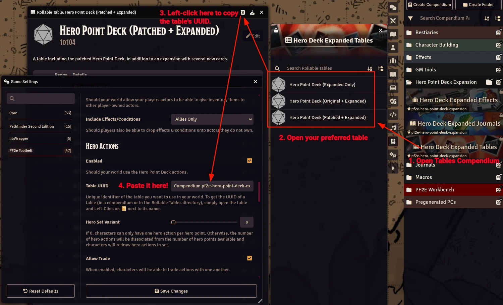

# PF2e Hero Point Deck Unofficial Expansion
A simple compendium module containing a journal with several unofficial cards1 to expand upon the original Hero Point Deck, as well as rollable tables incorporating these new cards with it, and tweaks for some of its cards.
## What is the Hero Point Deck?
It is a [deck of cards made by Paizo](https://paizo.com/products/btq024ut) to use in conjunction with Hero Points. Each card has a trigger and an effect that you must spend a Hero Point to use, and when you do, you discard both the card and the Hero Point. In that sense, you can think of the card as representing your Hero Point. You can still spend Hero Points for their normal reroll and death-prevention uses.
## What does the expansion contain?
- A journal with several new cards to expand the original Hero Point Deck.
- A journal with "balance patches" for existing cards where I have felt their power level is lacking for the cost of a Hero Point.
- A compendium of effects automating the cards, whenever possible.
- Rollable tables to draw a random card, whether you want to use this module's cards exclusively, or alongside the original Hero Point Deck, as well as one with the rebalanced original deck, plus the expansion.
## How to use this module?
Once you have enabled the module, you will see a compendium folder named "Hero Point Deck Expansion" containing three compendia. If you want to browse the cards, go to the journals compendium to see the expansion and patched cards. Once you're ready to start drawing random cards, go to the module's tables compendium and drag the table you want to your macro bar!

While rollable tables are sufficient to draw random cards, I highly recommend you install and use [PF2e Toolbelt](https://foundryvtt.com/packages/pf2e-toolbelt)'s [Hero Actions](https://github.com/reonZ/pf2e-toolbelt/wiki/Hero-Actions) feature. The module will allow your players to use, discard, and even trade cards amongst each other, all from their own character sheets! All you need to do is go to PF2e Toolbelt's settings and paste the link of the table you want to draw cards from. See picture below for reference and follow the the instructions in PF2e Toolbelt's settings.

## A word on Kineticist
Kineticist is mechanically unique, and many cards do not take these mechanics into account. Here are some quick and dirty rules to allow kineticists to use these cards. For the purposes of using or triggering Hero Point Card:
- A kineticist can treat an Elemental Blast as a Strike. If needed, they count as an unarmed attack in the brawling group.
- A 2-action impulse (including Elemental Blast) can be treated as a cantrip.

As a GM, you should feel free to improvise and allow a card to work with kineticist if it feels appropriate.
# Contributing
If you find any errors feel free to [open an issue](https://github.com/TikaelSol/pf2e-playtest-data/issues) and I'll get to it as soon as possible.

If you want to make a data contribution, follow these steps.
1. Fork this repository and clone it.
2. Install [NodeJS](https://nodejs.org/en) and [Git](https://git-scm.com/downloads).
3. Navigate to your cloned repo and run `npm ci`.
4. Run `npm run build` to build the module from the source.
5. Make sure Foundry is closed, run `npm run link`, and enter the path to your Foundry's user data folder. Keep in mind this will delete any existing version of the module in that folder, and it will create a symlink between your cloned repo and the module in your Foundry.
6. From here, you can start working on the module inside Foundry. Once you're done working, close Foundry.
7. Run `npm run extractPacks` to extract the changes you made in Foundry into your cloned repo.
8. Commit and push, then create a PR.

For a more in-depth walkthrough on Data Entry contributions, visit the PF2e system wiki's page [Helping with Data Entry](https://github.com/foundryvtt/pf2e/wiki/Helping-with-Data-Entry).
# Licenses
All the scripts are adaptations of the scripts found in the [PF2e Playtest Data](https://github.com/TikaelSol/pf2e-playtest-data) module, licensed under the Apache License 2.0

Game system information and mechanics are licensed under the Open Game License (OPEN GAME LICENSE Version 1.0a).

# Acknowledgements
I want to give a special thanks to:

Tikael and all contributors of the PF2e Playtest Data module, which served as the blueprint for most of this module's non-data content.

The [Tabletop Gold Podcast](https://www.tabletopgold.com/), which got me started on the journey of making all these cards with their listener submissions.

Thanks to Paizo for making an awesome game and making it easy for people to make stuff with it.

---
1. It is all journal entries, there were no actual cards involved in the making of this module.